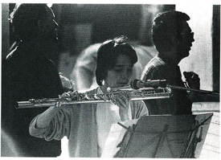

### Zum Projekt der durchscheinenden Etüden

[veröffentlicht in: Blick zurück nach vorn, ein Buch zur praemoderne, Thürmchen Verlag, Köln 1992]

##### Vorbemerkung

 

Der hier vorliegende Text entstand im Juli 1991 als Ausarbeitung eines Manuskripts, das ich anläßlich des Kölner PRAEMODERNE-Festivals vorbereitet hatte. Ich denke, es ist wichtig, auf die allgemeine Verunsicherung im Zuge der postmodernen Funktionalisierung der Künste mit konkreten Konzepten zu antworten, die zeigen, daß es immer noch möglich ist, die Ausdrucksmöglichkeiten einer Musiksprache weiter zu entwickeln. Deshalb schäme ich mich nicht, mit diesem im engeren Sinne kompositionstheoretische Dinge behandelnden Text an der in diesem Band angestrebten Diskussion der Moderne teilzunehmen.

 

 

##### Vorarbeiten

 

Als unfreiwilliges Resultat einer Fehlkopie (ich wollte einen 8-seitigen Entwurf meines Stückes *Verzweiflung der Töne* fotokopieren, legte den Stapel verkehrtherum in ein automatisches Kopiergerät, so daß sich nur kopierte, was sich im Manuskript bis auf die Rückseiten durchgedrückt hatte) erhielt ich im Herbst 1990 acht DinA4-Blätter, auf denen relativ ungleichmäßig mehr oder weniger viele kleine schwarze Punkte zu sehen sind. Diese gefielen mir gleich, wobei ich glaube, daß ich zunächst nicht so sehr an die Weiterverwertung in der kompositorischen Arbeit gedacht habe, sondern daß für mich eher die Vorstellung faszinierend war, dieses absolut unvorhergesehene Relikt einer Notation, die graphisch betrachtet kaum Analogien zum Klangergebnis hat, wiederum ihres Übersetzungscharakters entledigt zu sehen, so daß graphische Gebilde entstanden, die für mich unmittelbar archaischer Abdruck möglicher Musik hätten sein können. Die Punkte als Töne bzw. Klänge zu sehen drängte sich mir auf und eine Eigenart der Blätter, nämlich daß zwischen den Punkten im Vergleich zu ihnen verhältnismäßig riesige weiße Flächen waren, verstärkte das Gefühl, eine prinzipiell musikalische Situation zu erleben, denn der Ton definiert sich durch sein Umfeld, und der leere Raum zwischen den Tönen ist die naheliegenste Möglichkeit, den Ton so zu definieren, daß ihm besondere Aufmerksamkeit zuteil werden kann[^1].

Diese Blätter habe ich also zunächst als solche betrachtet und dann etwas später mit verschiedenen Rastern belegt (um die Punkte dann doch übersetzen zu können) mit dem Hintergedanken, daß mir die Auseinandersetzung mit einem in erheblichem Maße vorherbestimmten Material einmal wieder ganz guttun könnte. Ich dachte daran, einige dieser Blätter probeweise in Solostücke für Klavier oder für Baßflöte umzusetzen. Ein spezielles Problem erwies sich für mich als außerordentlich fruchtbar: wenn ich diese Versuche als Musik ernstnehmen wollte, zwang mich die lose Struktur der Vorlagen, mich sehr intensiv mit dem einzelnen Detail zu beschäftigen, um überhaupt Zusammenhänge zu erreichen, die bei der Loosigkeit des Materials in der Lage waren, die relativ großen Lücken zwischen den Ereignissen zu überbrücken. Nach einiger Wartezeit entschloss ich mich dann, die Blätter systematisch zum Ausgangspunkt verschiedener Serien von kleineren Stücken zu machen, und zwar einer Serie für 1 - 3 Flöten *(durchscheinende Etüden I-VIII/a),* einer für 1 - 5 Streicher *(durchscheinende Etüden I-VIII/b),* einer für 1 - 3 Orchestergruppen *(durchscheinende Etüden 1-VIII/c)*[^2] und einer für verschiedene Kammermusikbesetzungen *(durchscheinende Etüden I-VIII/d)[^3].* Bis jetzt (Sommer 1991) ist ca. ein Drittel der 32 projektierten Etüden abgeschlossen.

Abbildung 1 Normisa Pereira bei der Uraufführung von "durchscheinende Etüde V/a"

 

 

##### Festlegung des Rasters

 

Als ausschlaggebend für den Entschluß, das Projekt der durchscheinenden Etüden zu entwerfen, ergab sich die Arbeit an einem Stück für Baßflöte (die spätere *durchscheinende Etüde V/a).* Es schien mir notwendig zu sein, von der Flöte potentiell alles Mögliche zu verlangen. Bei der Festlegung des einen Parameters, der von den Punkten auf dem Blatt abgenommen werden sollte, der Tonhöhe (Lage des Punktes in der Vertikale), habe ich also das Äußerste der Möglichkeiten einer Baßflöte zugrundegelegt, nämlich die fünf Oktaven vom tiefsten tongue-ram *(Des)* bis zu den höchsten whispertones bzw. bis zu mit dem Mund gepfiffenen Tönen *(des"").* Die ganze Höhe des Blattes habe ich in drei Teile à knapp 10 cm geteilt (auch dann erlaubt die Einteilung in fünf Oktaven auch noch ohne weiteres die Differenzierung von Tonschritten kleiner als einem Viertelton), so daß das Blatt sozusagen in drei untereinanderstehende Systeme unterteilt ist, die nacheinander abgelesen werden. Das erschien mir auch deshalb als sinnvoll, weil dann die Betrachtung der Punkte in Bezug auf die Horizontale überschaubarer ist. Das ganze Tonhöhenraster habe ich bei manchen Stücken um eine Oktave transponiert.

Die Lage des Punktes auf der Horizontale bezeichnet den Zeitpunkt des Einsatzes der entsprechenden Note[^4]. Dieses "Standartraster" habe ich auf alle acht Blätter heraufprojiziert, so daß alle Stücke im Prinzip den gleichen Tonhöhenumfang und die gleiche Dauer aufweisen.

 

 

Umsetzung der Punktevorlagen

 

Der erste Arbeitsschritt ist ein rein mechanischer, von allen acht Blättern habe ich eine "1 Umschrift" vorgenommen, in der ich die Tonhöhe in 1/8-Tönen und die Einsatzpunkte in 1/10-Millimetern angegeben habe. Der zweite Schritt war dann die Umrechnung des Millimeterwertes in den jeweils nächstliegenden rhythmischen Wert (kleinste Einheit = 1/32-Quintole). Ergebnis dieses Prozesses sind acht Vorlagen, die den acht graphischen Blättern nachvollziehbar entsprechen. Jede der Vorlagen wird dann jeweils viermal weiterverarbeitet (in den vier Serien *I-VIII/a, b, c* und *d*)

Dieses ist die Hauptarbeitsphase und sie ist gekennzeichnet durch Konfrontationen und Umwege. Im weitesten Sinne wird eine Adaption der Vorlage an die im Einzelfall des Stückes gewählte Instrumentalbesetzung vorgenommen. Im Prinzip ist diese Arbeit vergleichbar mit der Instrumentation im klassischen Kompositionsprozess, mit dem Unterschied, daß hier praktisch alle Entscheidungen getroffen werden müssen, die das Stück prägen. Ein Grundzug der *durchscheinenden Etüden* ist also die Emanzipation der Instrumentation bzw. der die Instrumentation bestimmenden sekundären Parameter wie Klangfarbe, Lautstärke, Artikulation usw. weg vom Nimbus als kolorierendem Beiwerk oder schmucker Oberfläche hin zu auch struktureller Verantwortlichkeit für das musikalische Ganzes[^5]. Im Einzelfall kommt es oft vor, daß die strenge Übertragung eines Momentes auf die entsprechenden Instrumente einfach unmöglich ist, so daß Fantasie gefragt ist, um eine Lösung zu erzielen, die einige Einzelheiten der Stelle berücksichtigt und für die anderen möglichst überzeugende Stellvertreter findet. Genauso anregend ist es, wenn die Übertragung einer Stelle zwar problemlos möglich ist, aber die musikalische Schlüssigkeit dieses Momentes nicht einleuchtend ist (daß genauso gut andere Töne, oder gar keine, statt der hier geschriebenen, hier stehen könnten, wenn ich einmal die ganze Technik vergesse und nur das musikalische Ergebnis betrachte). Manchmal genügt die Veränderung eines winzigen Details, um die Stelle zu retten, und manchmal muss ich kompositorische Bocksprünge unternehmen und es funktioniert womöglich immer noch nicht. Auf diese Weise entstehen Rohfassungen und erste Fassungen der Stücke, die ich dann meistens später wieder verändere; bei dieser Arbeitsweise kommen praktisch bei jeder Beschäftigung mit dem Stück neue Ideen, die meistens auch zu Verbesserungen führen können. 

 

##### Neubearbeitung gleicher Vorlagen

 

Nach der Fertigstellung einiger Stücke (die Arbeitsweise verändert sich mit der Zeit, das Repertoire an klanglichen Möglichkeiten vergrößert sich von Stück zu Stück, und vor allem ungewohnte Erweiterungen wie Zusatzinstrumente, szenische Elemente etc. werden zunehmend in Betracht gezogen, so daß insgesamt die Stücke untereinander doch ziemlich unterschiedlich ausfallen) kam es natürlich dazu, daß die gleiche Vorlage verschiedenen Stücken zugrunde gelegt wurde. In dieser mich zunächst irritierenden Situation (ist das neue Stück mit den gleichen Tönen wie das alte überhaupt etwas eigenständig Neues und nicht nur eine 2. Version des alten Stückes?) hat sich gezeigt, daß das ganze Projekt - zumindest nach den Maßstäben, die ich an es anlegen wollte - tragfähig war. Zwei Stücke mit den gleichen Tönen können so unterschiedlich wie nur möglich sein, wenn man es will[^6].

##### Echokonzeptionen

 

Der Wunsch nach sehr hoher Plastizität der Einzelereignisse (bei dem zunächst sehr punktuellen Ton-für-Ton Denken, das im Wesen des ganzen Projektes angelegt ist, hat diese meistens alleroberste Priorität) hat mit der Zeit dazu geführt, daß für mich der Aspekt der räumlichen Differenzierung von Klängen immer wichtiger wurde. Besonders Echokonstellationen vielfältiger Art[^7] stellten sich für die Konstituierung von Zusammenhängen auch über größere Strecken hinweg als hilfreich heraus.

  

##### Simultankonzepte

 

In der letzten Zeit denke ich - auch als Konsequenz aus der Arbeit an den Aspekten der räumlichen Differenzierung - verstärkt darüber nach, was davon zu halten wäre, die Stücke, denen jeweils die gleiche Punktevorlage[^8] zugrunde liegt, gleichzeitig aufzuführen. Da die Stücke in einem solchen Fall quasi baugleich sind[^9]), ergibt ein gleichzeitiges Spielen eine Art von differenziertem Unisono, mit leichten Abweichungen der Stücke untereinander. Die meistens drei verschiedenen Ensembles[^10] sollen grundsätzlich an verschiedenen Punkten des Raumes plaziert sein (damit jede Gruppe möglichst stark als eine Einheit in sich wahrgenommen werden kann und die unterschiedlichen Schwerpunkte, die jede Gruppe setzt, als Ereignisse auch von räumlicher Tragweite erscheinen), und für die zeitliche Koordination der Gruppen untereinander sehe ich die drei folgenden Möglichkeiten:

- eine strenge Version; mithilfe eines Dirigenten koordinieren sich alle Ensembles, so daß die Schichten quasi deckungsgleich übereinanderliegen.

- eine freie Version; jedes Ensemble spielt für sich selbst, so daß unvorhergesehene kanonische und Echowirkungen entstehen[^11].

- eine ausgearbeitete (oder auszuarbeitende) Version; die Ensembles sind untereinander koordiniert (wie in Nr. 1). Es werden allerdings Auslassungen gemacht, so daß die Aufmerksamkeit bewußt hin-und hergelenkt wird.

  

##### Zwei Thesen:

 

Zum Abschluß dieses Textes möchte ich hier noch zwei Thesen aufstellen, die mir anhand der Beschäftigung mit dem kompositionstheoretischen Umfeld meiner durchscheinenden Etüden deutlich wurden, und die mir auch für das Schreiben von Musik allgemein für beachtenswert erscheinen:

 

1. Kompositionstechnik soll mehr Schwierigkeiten schaffen, als sie Schwierigkeiten löst.

2. Eine Idee des Stückes als Ganzes soll im Arbeitsprozess so lange wie möglich offen bleiben.

  

##### Einige Anmerkungen hierzu:

 

Problematisch ist es, wenn sich kompositionstechnische Verfahrensweisen insofern verselbständigen, daß individuell getroffene Kompositionsentscheidungen in einer Weise übertragbar gemacht werden, für die sie nicht geeignet sind. Die Gefahr, fast alle Elemente einer Komposition auf diese Weise zu determinieren, ist dann sehr groß. Wenn zu viel Material durch zu wenige spezifische Entscheidungen bewegt wird, kann die besondere Fähigkeit eines Musikstückes, mit Entschiedenheit einem bestimmten Momentgefühl Ausdruck zu verleihen, gefährdet sein. Technische Hilfsmittel können im besten Fall dazu dienen, daß sozusagen die Probleme auf ein anderes Niveau gehoben werden, wo sie dann in neue konstruktive Zusammenhänge als noch zu bewältigende Probleme eingeführt werden können.

Wenn das Stück erst in einer sehr späten Phase der Arbeit zum Stück (im Sinne eines geschlossenen Ganzen, das ein individuelles Gepräge aufweist) wird, wenn ich mich also erst in einem sehr späten Moment der Arbeit nach den speziell typischen Eigenschaften des Stückes frage und diese dann vielleicht noch einmal so herauszuarbeiten versuche, daß sie diesem gerade entstehenden Stück besonders entsprechen, sehe ich die Chance einer Differenziertheit seines Charakters am größten. Die Idee des Stückes kann so aus einem Geflecht von Einzelideen aus verschiedenen Arbeitsphasen, die sich auf den unterschiedlichsten Denk- und Empfindungsebenen befinden, bestehen.

------

[^1]:  selbstverständlich soll eine solche Aussage nicht als allgemeingültiges Werturteil verstanden werden. In meiner speziellen Situation war es regelrecht befreiend, Töne einzeln zu betrachten, denn ich empfand es schon seit längerem als beengend, daß meine Musiksprache mehr und mehr in Richtung auf ausgiebiges Wiederholen von wenigen in sich stark reduzierten Einzelelementen festgelegt zu sein schien. Das ist einzeln betrachtet interessant, nur hatte ich das Gefühl, zu schnell und zu leicht zu arbeiten, weil ich über ein gewisses Repertoire von Automatismen verfügte, die ich kaum mehr aus dem Arbeitsprozess heraushalten konnte. So hatte ich schon seit Längerem verschiedene Versuche unternommen, die Voraussetzungen beim Schreiben eines Stückes so zu ändern, daß ich mich in Extremsituationen wiederfand, die mich zwangen, ganz anders vorzugehen, als ich das gewohnt war. Am Deutlichsten war das bei dem Orchesterstück *13b* (1989) sichtbar, bei dem fast alle Arbeitsschritte mithilfe von Zufallsoperationen durchgeführt wurden, und über Art und Umfang des jeweils nächsten Bearbeitungsmodus erst entschieden wurde, wenn der alte jeweils abgeschlossen war, so daß ein doch recht spezielles Gefüge verschiedenartiger Zusammenhänge entstand oder bei dem umfangreichen Kammermusikstück *Der unsichtbare Gegenstand* (1987/88), in dem ich versucht habe, reine Musik über sich hinaus entwickeln zu lassen, bis hin zu allen möglichen Verfremdungen sowie dem Einsatz von Tonbandmanipulationen, Sprache und szenischen Elementen.

[^2]: Bei der Arbeit an den Orchesterstücken halte ich mir die Freiheit offen, in jedem Moment die Zeit anzuhalten und den Status Quo einzufrieren. Ausgehend von den Möglichkeiten eines Orchesters ist es hier besonders wichtig, den Raumaspekt möglichst stark auszuarbeiten, ohne dafür auf musikalische Differenzierung verzichten zu müssen.

[^3]: *I-VIII/d* sind mehrteilig. Der jeweils erste Teil setzt, vergleichbar zu den Serien *I-VIII/a - c,* die entsprechende Vorlage den Vorgaben gemäß um. Die dann folgenden Teile können als Kommentare bzw. Alternativen aus anderem Blickwinkel zu dem jeweils ersten Teil verstanden werden.

[^4]: Die Entscheidung, gerade die zwei konventionell vorherrschenden Parameter, Zeit und Tonhöhe, festzusetzen, und nicht andere, in der Musikgeschichte als "sekundäre Parameter" bislang eher nachlässig behandelte, wie z.B. Lautstärke oder Klangfarbe, mag dadurch begründbar sein, daß das ganze Projekt für mich sehr stark auch dadurch motiviert ist, mir sozusagen von der Basis auf einen flexibleren Umgang mit den mir zur Verfügung stehenden Mitteln zu erarbeiten. Da liegt es nahe, mit dem Einfachsten anzufangen. Nichtsdestotrotz freue ich mich auch darauf, einmal diese Voraussetzungen auf verschiedene Arten und Weisen umzudrehen.

[^5]: Hier trifft das Projekt ein mich auch vorher beschäftigt habendes Bedürfnis. Der Ansatzpunkt war gegenteilig aber der Wunsch derselbe: z.B. gliedert sich das Orchesterstück *Totentanzstudie* (1987/88) u.a. dadurch, daß sich bei einem in Rhythmus und Tonhöhe quasi minimalistisch immer gleich wiederholendem Modell nur die Instrumentation ändert (das aber in einer Bandbreite von unmerklich bis sehr drastisch).

[^6]: Mein selbstpädagogischer Ansporn, bei der Arbeit zu lernen, findet hier ein reiches Betätigungsfeld. Aus der gleichen Tonkonstellation für verschiedene Stücke jeweils verschiedene und eigenständige Sinnzusammenhänge herauszuarbeiten, verlangt oft Ideen, auf die ich wohl ohne diese spezielle Problemstellung nicht gekommen wäre. Es macht mir großen Spaß, so quasi unkünstlerisch-handwerkelnd an den Arbeitsprozess heranzugehen, indem ich mir oft Detailprobleme stelle, deren Lösung meistens mühsam ist. Ich habe das Gefühl, daß so eine etwas distanziertere Arbeitsweise den Kopf eher frei hält für originär musikalische Empfindung als die Konzentration auf das Musikstück als Werk von Anfang an.

[^7]: Über das vereinfachende, leisere Wiederholen des zuletzt Erklungenen von einem anderen Ort (Standartecho) hinaus bieten sich noch zahlreiche weitere Arten von räumlichen Antiphonien an, die ich noch als Echos bezeichnen würde, so z.B. ein vergröberndes Echo (z.B. indem mit Trivialinstrumenten ein sehr feines Klanggebilde imitiert wird), ein verfeinerndes Echo (das simplere Klanggestalten verfeinert, oder das Gestalten einheitlicher Klangfarbe umsetzt in welche, die aus extrem verschiedenen Klangfarben zusammengesetzt sind), ein vergrößerndes Echo (z.B. dadurch, daß das Echo viel lauter als die Vorlage ist), ein Tonhalte-Echo (in welchem ein momentaner Klang von der Vorlage im Echo aufgenommen und einfach angehalten wird, womöglich auch so lange, daß Überlagerungen mit weiteren Echos entstehen), ein rückbeziehendes Echo, alle Arten von Vorechos und Simultanechos, Multi-Echos aus zwei oder mehr Punkten im Raum. All dies sind Echos, in denen ein Charakteristikum, das man üblicherweise dem Echo zuordnet, zutrifft, nämlich daß die "Antwort" von einer anderen Stelle innerhalb des Raumes zu hören ist als das eigentliche Hauptgeschehen. Der Aspekt der Fremdheit der neuen Raumposition (oder der Überraschung über sie), den man auch als echotypisch ansehen könnte, läßt sich konkret musikalisch z.B. dadurch unterstützen, daß Echos selten auftreten, oder daß sie für das Publikum nicht sichtbar sind. Selbstverständlich sind ebenso auch transzendierte Echos möglich, in denen deutlich echoartige Phänomene (wie die oben genannten) ohne die Veränderung der Position im Raum auftreten. Eine weitergehende Ausnutzung von Echosituationen bietet ebenfalls die Möglichkeit des Echotausches, d.h. daß das mit dem Hauptgeschehen betraute Ensemble und das Echoensemble ihre Funktionen tauschen.

[^8]: Ich möchte hierfür nur die *durchscheinenden Etüden I-VIII/a, b* und *d* in Betracht ziehen, also nicht die Orchesterstücke *(I-VIII/c),* da diese zum einen die Kammermusikstücke überdecken könnten, und zum anderen schon in sich auf eine Simultaneität von bis zu drei im Raum verteilten Orchestergruppen angelegt sind. Im Einzelfall wird es auch nötig sein, bei einem Simultankonzept auf eine der drei in Frage kommenden Etüden zu verzichten, wenn sonst zu viel Differenzierung verloren ginge. Eventuell muss auch die Instrumentation geändert werden.

[^9]: obwohl ja gerade die Detailunterschiede zwischen den entsprechenden Etüden von immenser Wichtigkeit sind. Ich glaube allerdings, daß gerade die besondere Bedeutsamkeit der sich voneinander unterscheidenden Einzelheiten eine besondere Binnenspannung in dem musikalischen Gefüge eines solchen Simultankonzeptes erzeugen kann.

[^10]: Im bisher konkret einzigen Fall, in welchem ich bis zu einem Simultankonzept vorgedrungen bin, handelt es sich um die Gleichzeitigkeit der *durchscheinenden Etüde I/a* (Version 2) für Flöte solo, der *durchscheinenden Etüde I/b* für Geige, Bratsche und Kontrabaß sowie des ersten Teiles der *durchscheinenden Etüde I/d* für Schlagzeug und Klavier.

[^11]: Da bei den meisten Etüden ein erheblicher Spielraum bei der Wahl des Tempos gegeben ist (Viertel = 1 - 2 Sekunden), können schon allein dadurch erhebliche Abweichungen der Ensembles untereinander entstehen.