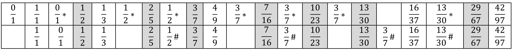

#### Caspar Johannes Walter

### **Variants of continued fraction algorithms and their relationship to the fraction windowing algorithm for modeling the sounding pitches of multiphonics on piano strings** 

Freiburg, August 2019[^1]

© 2019 Caspar Johannes Walter

Translation, Carter Williams

 

###### ABSTRACT

In order to calculate the frequency components of so-called pure multiphonics (multiphonics consisting of harmonic partials of the fundamental) on vibrating strings, I developed my fraction windowing algorithm. This article discusses in detail how the fraction windowing algorithm works and its relationship to the closely related mathematical concept of a continued fraction. Ten variants of continued fraction algorithms are characterized and compared to the fraction windowing algorithm. At the end of the article, I summarize other general observations I made during my studies of continued fractions types.

(87 words)

content:

- Introduction

- The rules of the fraction windowing algorithm

- An extension of the fraction windowing algorithm

- Fraction windowing algorithm and continued fractions

- Continued fraction types

- Overview of continued fractions types

- Various other findings related to continued fraction variants

- Loop formations, Sisyphus continued fractions, and continued fraction explosives

#### Introduction

Several years ago[^2], when I began to study the structure of the frequencies present in multiphonics on vibrating strings[^3], it occurred to be that the partials (integer multiples of the frequency of the fundamental pitch of the string) in a given multiphonic seemed to follow some sort of orderly mathematical structure. Often it was the case that it was possible to discern a four-note chord by ear, and these chords consisted of two central frequencies and two additional pitches that represented the sum and the difference of these central frequencies. Adjacent to such a multiphonic, the point of contact on the string for two further multiphonics can be found. In these neighboring multiphonics, the sum tone of the first multiphonic becomes one of the central tones (accordingly, the partial numbers increase). By continuing this processes step by step, I determined that the location of points of contact for multiphonics, represented as fractions of the total string length, can be mapped across the entire length of the string. I then developed an algorithm that is able to compute all the possible sounds in an idealized system (the actual limitations imposed by various parameters in a physical system were not considered in this model). I named this algorithm the fraction windowing algorithm. The ‘multiphonic maps’ of piano strings, which were based on this algorithm, have in the meantime become an important basis for composing and performing music with these sorts of multiphonics. Moreover, the algorithm makes it possible to find the point of contact for a multiphonic when only two of the sounding components are known by running the algorithm backwards. This too is of course a very useful practical tool for composers and performers when working with these multiphonics. The fraction windowing algorithm is a mathematical tool that does not take into consideration the physical limitations of instruments, such as the fact that it possible to hear very high partials in the sound depending on the material the string is made of, how it is excited, its length, thickness, and tension.

.jpg)

Figure 1, Multiphonic ‘map’ on the piano, screenshot from the app ‘Piano Multiphonic Calculator’: the point of contact for the multiphonic at $\frac{5}{12}$ is marked in red

#### **The rules of the fraction windowing algorithm**

 

I chose the name fraction windowing algorithm because I imagined that a number lies on a visible section of the continuous number line. This is the window. The frame of the window is initially defined by the natural number below the number inputted into the algorithm and the next highest natural number. These are the first two sides of the window frame (the stiles) and also the first two elements of the sequence. Now as a third element, a bar is inserted between adjacent panes of glass (a muntin): to do this the mediant (Farey sum)[^4] of the first two elements is calculated. This yields two window openings. By comparing the number inputted with the last element of the sequence of fractions (the position of the last vertical bar that divided the window), it is determined in which of the two window openings the inputted number lies. Between the two visible frames boundaries (the last vertical bar and one of the two previous sides of the frame) a further mediant will be calculated, and the procedure will be continued until the number inputted is reached (when a fraction has been inputted) or the desired level of precision has been reached for a fractional approximation. Each new fraction in the sequence is always the simplest possible fraction between the active sides of the frame (these are the next vertical bars dividing the window above or below the inputted fraction), that is to say the fraction with the smallest denominator – put in terms of musical perception the one with the lowest pitch. In this procedure, each point on the number line, i.e. every point on the string, can be represented or approximated mathematically.

Taking the natural numbers[^5] as the starting point for the procedure, a sequence of fractions is generated. The initial two natural numbers in the form of 
$$
\frac{N}{1} , \frac{N + 1}{1}
$$
 are the first two sides (the frame boundaries) of the window. When applying the algorithm to the calculation of multiphonics on a vibrating string, these are 0 and 1 in the form 
$$
\frac{0}{1} , \frac{1}{1}
$$
 representing the beginning and end of the string. Each subsequent fraction of the sequence is the mediant of the two current frame sides. The third fraction in the sequence given these two initial terms is thus 
$$
\frac{2N + 1}{2}
$$
(for a vibrating string, the result would be $\frac{1}{2}$)

Depending which section of the window is closed in the next step, the fractions that define the currently visible frame now become the active frame boundaries. The next fraction in the sequence is found between these two frame boundaries. In each case, one of the frame boundaries is the last term in the sequence of fractions; the second frame boundary may be the penultimate or earlier term. In the case of a regular convergence (alternating from below and above the inputted number), it is always the last two fractions. In a stepwise approach from one side (what I call mutation), the frame boundaries are the last fraction and not the penultimate, but rather an earlier term in the sequence that is still an active frame boundary – it is the window frame on the other side of the last vertical bar that is closest.

.jpg)

Figure 2, Fraction windowing approaching $\frac{5}{12}$

#### An extension of the fraction windowing algorithm

 

By running the algorithm backwards using a subtraction procedure[^6], it is possible to calculate the numerators of two fractions whose denominators are known. Between any two natural numbers, there are always exactly two of these pairs of fractions arranged symmetrically about the halfway position of the two natural numbers that form the frame boundaries (in the case of our string with a range of 0 to 1, the halfway point is 
$$
\frac{1}{2}
$$
and examples of a symmetrical pairs would be 
$$
\frac{1}{3} , \frac{2}{5}
$$
 and
$$
\frac{2}{3} , \frac{3}{5}
$$

This extension is useful in a musical context[^7]. As the denominator corresponds to the pitch of the partial present in a multiphonic, this variation of the algorithm makes it possible to calculate the point on a vibrating string to touch so that these two given partials are present in the multiphonic along with other pitches of the multiphonic, which can also be calculated using this procedure.

 

#### **Fraction windowing algorithm and continued fractions**

 

One nice side effect of the fraction windowing algorithm is that it is a simple and powerful tool for approximating rational and irrational numbers with fractions. Others have pointed out that my fraction windowing algorithm is actually a type of continued fraction and that continued fractions are even more effective when trying to identify a good fractional approximation. This is of course true: the sequence of fractions associated with a fractional approximation derived from a continued fraction is shorter than or at most the same length (in the case of sequences of Fibonacci fractions[^8] that lack mutations) as the sequence of fractions generated by the fraction windowing algorithm. Nevertheless, I was left with an uneasy feeling because the continued fractions skip over some good approximations that the fraction windowing algorithm includes, or these are only present if adjacent fractional approximation are included in the sequence. Thus, the sequence seems to be less homogeneous than the one generated by the fraction windowing algorithm. All in all, the sequence of fractional approximation derived from a continued fraction is made up exclusively of fractions derived from the fraction windowing algorithm, but the continued fraction method excluded some of these fractions, which represent the pitches that have the potential to sound as a component of a multiphonic. I felt that this was an unfortunate omission. It is a nice property of the fraction windowing algorithm that it is able to represent an audible sound result in numbers that can be explained as a logically consistent structure. Perhaps continued fractions would also be able accomplish this, as they are so closely related to the fraction windowing algorithm in terms of their internal mathematical structure.

This discrepancy (as well as the structures of numbers in general) continued to be of interest to me. Thus, in the summer of 2017, I began to work more intensively on continued fractions. I am not a mathematician, and I do not pretend to have a clear overview of the state of research in this area. Therefore, it is quite likely that the ideas formulated here are already well-established in the mathematical literature. However, in the course of my research, I was unable to find many relevant sources[^9]. Thus, I have tried to provide a starting point for a discussion in the form of a collection of continued fraction examples, which will allow someone who is familiar with the material to simply and quickly follow my line of reasoning. An essential goal of my investigation was the to find a type of continued fraction that includes all the fractions generated by my fraction windowing algorithm and no other fractions. I then proceeded to make a classification of several variant types until I identified such a type (type 10).

I am very interested in receiving feedback from readers about how and with what term mathematicians have more succinctly formulated these ideas and any fundamental errors I may have missed. For the primarily musically oriented reader, the following section is then less interesting, as the explanations do not have anything to do with music directly. But for those who delight in the structures of numbers that can also be used to represent musical sounds, the following sections should be an enjoyable read. 

 

#### **Continued fraction types**

 

Continued fractions[^10] can be associated with sequences of fractional approximations. The fractional approximations that result from continued fractions converge on a number alternatively from below and above. In comparison to the fraction windowing algorithm, two points stand out:

- Some fractions that result from the fraction windowing algorithm are almost always skipped (except in the special case of Fibonacci fractions).

- If we examine the fractions from the sequence generated by the fraction windowing algorithm that are skipped, there are sometimes fractions that are very close to the number inputted, but these are not included in the fractional approximations derived from the continued fraction.

Point b can be easily explained by the fact that in a continued fraction the particular fractional approximation must be smaller or larger depending on the number of fraction bars in the continued fraction. In the case of an uneven number of fraction bars (the fraction bar of the remainder that is not included is not counted), the remainder after the corresponding plus sign, which is not included when the continued fraction is resolved to a fractional approximation, has the effect of making the result smaller (thus, the resolved fractional approximation is on the larger side when the remainder is not included – and vice versa).

It is interesting to compare the fractional approximations derived from continued fractions to the turning points in the fraction windowing algorithm. A turning point is my term for point in a sequence of fractions derived from the fraction windowing algorithm when the state of expansion or contraction changes. In comparing the sequences of fraction approximations derived from continued fractions with those derived from the fraction windowing algorithm, it stands out that every turning point in the sequence of fractions from the fraction windowing algorithm corresponds to a fractional approximation. It is always the fraction before the turning point (even though the fraction after the turning point is closer to the fraction inputted). The fractional approximations alternate between larger and smaller fractions, they define the upper and lower bounds of a window in which the inputted fraction lies and converge towards this number. Whether the last fractional approximation before the inputted fraction is an upper or lower bound depends on whether the number of fraction bars (and therefore the index of the fractional approximation) is even or odd.

This comparison brought up two questions for me:

- Is it possible to find variations of continued fractions whose fractional approximations represent the entire sequence of fractions generated by the fraction windowing algorithm?

- Is it possible to construct a continued fraction algorithm that arrives at the inputted number even more quickly by making productive use the original terms of the fraction windowing algorithm that are especially close to the inputted number? 

By experimenting with different parameters of the regular continued fraction algorithm, this resulted in several different and at times interesting variants of the algorithm, some of which were able to come close to or completely answer these questions I posed. I varied the following parameters: the + operators in the continued fraction, which can also be the − operator[^11]; the natural numbers including zero (in the rest of the text I will refer to these as coefficients) before the + (or −) operators, whose values can also be limited (e.g. such that only one, or only one and zero are allowed). The different combinations of these parameters yielded variation of the regular continued fraction algorithm, which I refer to here as continued fraction types.

For the analysis of the continued fraction types, the typical configuration of the sequence of fractions from the fraction windowing algorithm or the fractional approximations associated with the continued fraction were decisive: segments of the sequence of fractions could be regular in the fraction windowing algorithm (always alternating between smaller and larger approximations converging on the fraction inputted), but could also always move in the same direction (the cause of this is what I refer to as fraction windowing algorithm mutation). Turning points, i.e. changes in direction, occur between all terms in a regular sequence or directly before and after a continually increasing or continually decreasing segment. Especially when close to the fraction inputted, either the last or penultimate fraction can be found in a continually increasing or decreasing segment. Thus, the region around the turning point is particularly interesting in the process of searching for good approximations.

#### Overview of continued fractions types

 

The following will summarize the configuration of the parameters[^12] that define the continued fraction type, and if possible, the following questions will be answered:

- Which fractions derived from the fraction windowing algorithm appear in the fractional approximations?

- How is behavior at the turning points or in the continually increasing/decreasing segments?

In addition, the fraction $\frac{42}{97}$ will be used as an example and represented by the corresponding continued fraction type with its fractional approximations from index 0.

By way of comparison: the sequence of fractions from the fraction windowing algorithm for $\frac{42}{97}$ is 
$$
\frac{0}{1} , \frac{1}{1} , \frac{1}{2} , \frac{1}{3} , \frac{2}{5} , \frac{3}{7} , \frac{4}{9} , \frac{7}{16} , \frac{10}{23} , \frac{13}{30} , \frac{16}{37} , \frac{29}{67} , \frac{42}{97}
$$

Type 1 and Type 2 are two variants of continued fraction that each illustrate one side of turning point situations. Type 3 and type 4 provide a complete illustration of the mutation passages and when combined with one another contain all the fractions of the fraction windowing algorithm. Type 5 and type 6 illustrate all the turning point relevant situations in reverse. Type 7 is the fastest algorithm. Finally, types 8–10 contain all the fractions from the fraction windowing algorithm.

 

##### Type 1

The regular continued fraction

Coefficients can be any natural number or zero. Only positive operators are allowed. The fractions appear before the turning points. The sequence of fractional approximations with even indexes increases continually while the sequence with odd indexes decreases continually.

step by step:
$$
\frac{42}{97} = 0 + \dfrac{42}{97} = 0 + \dfrac{1}{2 + \dfrac{13}{42}} = 0 + \dfrac{1}{2 + \dfrac{1}{3 + \dfrac{3}{13}}} =0 + \dfrac{1}{2 + \dfrac{1}{3 + \dfrac{1}{4 + \dfrac{1}{3}}}}
$$

simplified: 
$$
0 + \dfrac{1}{2 + \dfrac{1}{3 + \dfrac{1}{4 + \dfrac{1}{3}}}} = 	\frac{42}{97}
$$

Fractional approximations:
$$
\frac{0}{1}, \frac{1}{2}, \frac{3}{7}, \frac{13}{30}, \frac{42}{97}
$$

##### Type 2 

Coefficients can be any natural number or zero. Only positive operators are allowed with one exception: the last operator is negative. The fractions appear after the turning points. The sequence of fractional approximations with even indexes decreases continually while the sequence with odd indexes increases continually.

$$
	1 - \dfrac{55}{97} =  
	0 + \dfrac{1}{3 - \dfrac{29}{42}} = 
	0 + \dfrac{1}{2 + \dfrac{1}{4 - \dfrac{10}{13}}} =
	0 + \dfrac{1}{2 + \dfrac{1}{3 + \dfrac{1}{5 - \dfrac{2}{3}}}} =
	0 + \dfrac{1}{2 + \dfrac{1}{3 + \dfrac{1}{4 + \dfrac{1}{3}}}} =
	\frac{42}{97}
$$
  Fractional approximations:

$$
\frac{1}{1}; \frac{1}{3}; \frac{4}{9}; \frac{16}{37}; \frac{42}{97}
$$

##### Type 3 

Coefficients can be any natural number. Only negative operators are allowed. Complete continuously decreasing segments (mutation passages) appear.

$$
1 - \dfrac{1}{2 - \dfrac{1}{5 - \dfrac{1}{2 - \dfrac{1}{2 - \dfrac{1}{2 - \dfrac{1}{4}}}}}} =	\frac{42}{97}
$$
Fractional approximations:
$$
\frac{0}{1}; \frac{1}{1}; \frac{1}{2}; \frac{4}{9}; \frac{7}{16}; \frac{10}{23}; \frac{13}{30}; \frac{42}{97}
$$

 

##### Type 4 

Coefficients can be any natural number or zero. Only negative operators are allowed with one exception: the first operator is positive. Complete continuously increasing segments (mutation passages) appear.

$$
0 + \dfrac{1}{3 - \dfrac{1}{2 - \dfrac{1}{2 - \dfrac{1}{6 - \dfrac{1}{2 - \dfrac{1}{2}}}}}} = 
	\frac{42}{97}
$$
 Fractional approximations:

$$
\frac{0}{1}; \frac{1}{1}; \frac{1}{3}; \frac{2}{5}; \frac{3}{7}; \frac{16}{37}; \frac{29}{67}; \frac{42}{97}
$$

 

##### Type 5 


Coefficients can be any natural number or zero. Operators alternate between positive and negative.

$$
0 + \dfrac{1}{3 - \dfrac{1}{1 + \dfrac{1}{3 - \dfrac{1}{1 + \dfrac{1}{4 - \dfrac{1}{1 + \dfrac{1}{2}}}}}}} =
	\frac{42}{97}
$$
 Fractional approximations:

$$
\frac{0}{1}, \frac{1}{3}, \frac{1}{2}, \frac{4}{9}, \frac{3}{7}, \frac{7}{16}, \frac{16}{37}, \frac{13}{30}, \frac{42}{97}
$$

 

##### Type 6 

Coefficients can be any natural number or zero. Operators alternate between negative and positive. This type yields all the turning point relevant fractions but reversed.

$$
1 - \dfrac{1}{1+ \dfrac{1}{2 - \dfrac{1}{1 + \dfrac{1}{3 - \dfrac{1}{1 + \dfrac{1}{4 - \dfrac{1}{1+\dfrac{1}{2}}}}}}}} = 
	\frac{42}{97}
$$
Fractional approximations:
$$
\frac{1}{1}, \frac{0}{1}, \frac{1}{3}, \frac{1}{2}, \frac{4}{9}, \frac{3}{7}, \frac{16}{37}, \frac{13}{30}, \frac{42}{97}
$$

 

##### Type 7 

‘Direttissima’ 

Coefficients can be any natural number or zero. Operators can be positive or negative depending on which one yields the smallest remainder. The example $\frac{42}{97}$  is not meaningful here because type 1 already fulfills all the conditions. The example of π show the power of this continued fraction type:

$$
3 + \dfrac{1}{7 + \dfrac{1}{16 + \dfrac{1}{294}}}
$$
 The first three fractional approximations:

$$
\frac{22}{7}, \frac{355}{113}, \frac{104348}{33215}
$$
The third fractional approximation is only ca. $3\cdot 10^{-10}$ larger than π . With a regular continued fraction $\frac{104348}{33215}$ would be the fifth fractional approximation.

 

##### Type 8

The ‘slowest’ counterpart to the direttissima

Coefficients can be any natural number or zero. Operators can be positive or negative depending on which one yields the greatest remainder.

$$
1 - \dfrac{1}{1 + \dfrac{1}{2 - \dfrac{1}{2 - \dfrac{1}{1 + \dfrac{1}{2 - \dfrac{1}{2 - \dfrac{1}{2 - \dfrac{1}{1 + \dfrac{1}{2 - \dfrac{1}{1 + \dfrac{1}{2}}}}}}}}}}} =
$$

$$
1 - \dfrac{1}{1 + \dfrac{1}{2 - \dfrac{1}{2 - \dfrac{1}{1 + \dfrac{1}{2 - \dfrac{1}{2 - \dfrac{1}{2 - \dfrac{1}{1 + \dfrac{1}{2 - \dfrac{1}{2 - \dfrac{1}{2}}}}}}}}}}} = \frac{42}{97}
$$

For the last coefficient there are two equal possibilities (remainder $\frac{1}{2}$). If one chooses the second possibility, the result is the entire sequence of fractions from the fraction windowing algorithm without any repetitions in a somewhat chaotic order: 

Fractional approximations:
$$
\frac{1}{1}, \frac{0}{1}, \frac{1}{3}, \frac{2}{5}, \frac{1}{2}, \frac{4}{9}, \frac{7}{16}, \frac{10}{23}, \frac{3}{7}, \frac{16}{37}, \frac{13}{30}, \frac{29}{67}, \frac{42}{97}
$$

##### Type 9 

Coefficients can only be one. Operators can be positive or negative.

$$
1 - \dfrac{1}{1 + \dfrac{1}{1 + \dfrac{1}{1 + \dfrac{1}{1 - \dfrac{1}{1 + \dfrac{1}{1 + \dfrac{1}{1 + \dfrac{1}{1 - \dfrac{1}{1 + \dfrac{1}{1 + \dfrac{1}{1 - \dfrac{1}{1 + \dfrac{1}{1 - \dfrac{1}{1 + \dfrac{1}{1 + 1}}}}}}}}}}}}}}} = \frac{42}{97}
$$
  Fractional approximations:

$$
\frac{1}{1}, \frac{0}{1}, \frac{1}{2}, \frac{1}{3}, \frac{2}{5}, \frac{1}{3}*, \frac{3}{7}, \frac{4}{9}, \frac{7}{16}, \frac{3}{7}*, \frac{10}{23}, \frac{13}{30}, \frac{10}{23}*, \frac{13}{30}*, \frac{16}{37}, \frac{29}{67}, \frac{42}{97}
$$

Comment on the fractions with *): $\frac{1}{0}$ returns a value that is infinitely large and in the next higher step a remainder that is infinitely small. If these fractions were omitted, the sequence of fractions would be the complete sequence from the fraction windowing algorithm in the correct order. 

 

##### Type 10 

Coefficients can only be one or zero. Only positive operators are allowed.

This completely replicates the fraction windowing algorithm. At each mutation a zero appears as the coefficient, which leads to a repetition of the previous result. If the first of each of these two fractions is disregarded (division by 0, marked with *), the sequence of fractional approximations is identical to sequence of fractions from the fraction windowing algorithm. Thus, a coefficient pair 0,1 indicates the steady progress in one direction caused by the mutation. Turning points always occur where there are two consecutive coefficients of 1 (the second of those indicates a turning point). The mutations can be located with the help of the coefficients (from top to bottom). The sequence of ones and zeros reads like a binary code.

$$
0 + \dfrac{1}{1 + \dfrac{1}{0 + \dfrac{1}{1 + \dfrac{1}{1 + \dfrac{1}{0 + \dfrac{1}{1 + \dfrac{1}{0 + \dfrac{1}{1 + \dfrac{1}{1 + \dfrac{1}{0 + \dfrac{1}{1 + \dfrac{1}{0 + \dfrac{1}{1 + \dfrac{1}{0 + \dfrac{1}{1 + \dfrac{1}{1 + \dfrac{1}{0 + \dfrac{1}{1 + 1}}}}}}}}}}}}}}}}}} = \frac{42}{97}
$$
 Fractional approximations:

$$
\frac{0}{1}, \frac{1}{1}, \frac{0}{1}*, \frac{1}{2}, \frac{1}{3}, \frac{1}{2}*, \frac{2}{5}, \frac{1}{2}*, \frac{3}{7}, \frac{4}{9}, \frac{3}{7}*, \frac{7}{16}, \frac{3}{7}*, \frac{10}{23}, \frac{3}{7}*, \frac{13}{30}, \frac{16}{37}, \frac{13}{30}*, \frac{29}{67}, \frac{42}{97}
$$
It is Interesting to compare this sequence with the algorithm used in the *Piano Multiphonic Calculator*, which finds the sequence of fractions of the fraction windowing algorithm when only the last two denominators are given (here 97 and 67) and their numerators are unknown by a running the calculation in reverse using a subtraction procedure: https://www.casparjohanneswalter.de/research/piano_multiphonic_calculator

 

Figure 3, comparison of the fractional approximations (type 10) above with the fractions generated by the app below

#) These terms are the fractions resulting from running the calculation backwards that are not shown. They replicate fractions that occurred earlier in the sequences in cases with mutations. Gray fields indicate fractions after which mutations followed. In both sequences, the marked fractions are strongly connected with the mutations (shaded grey).

 

The figure below shows a screenshot of the result of the fraction windowing algorithm for the input $\frac{42}{97}$ from the app *Fraction Windowing* on my website (the fraction $\frac{42}{97}$ is entered into the field labeled *or Fraction*): https://www.casparjohanneswalter.de/research/fraction_windowing. By way of comparison, the righthand side of the figure shows a coefficient notation of the fractional approximations for the continued fraction types 1–6. Type 7 would be identical to type 1, and types 8–10 would reproduce the complete fraction windowing algorithm.

.jpg)

Figure 4, Analysis of $\frac{42}{97}$ , continued fraction types 1–6

 

#### **Various other findings related to continued fraction variants**

 

The study of the properties of these continued fraction types invites one to either localize a regular pattern (see Fibonacci fractions), or to experiment, play with different configurations, and create paradoxes. Here we are no longer looking for a continued fraction that represents a given number, but rather looking at continued fractions themselves as the primary object of study (see loop formations, Sisyphus continued fractions, and continued fraction explosives). Type 8 as the particularly less successful counterpart to type 7 already goes in this direction. When several building blocks as assembled ‘wrong’, a mini monstrosity can be created whose information content decrease towards 0 as its size increases.

 

Different continued fractional representations of individual Fibonacci fractions

$$
4 + \dfrac{1}{4 + \dfrac{1}{4 + \dfrac{1}{4 + \dfrac{1}{4 + \dfrac{1}{3}}}}}	 = \frac{4181}{987}
$$

$$
3 - \dfrac{1}{3 - \dfrac{1}{3 - \dfrac{1}{3 - \dfrac{1}{3 - \dfrac{1}{2}}}}}	 = \frac{233}{89}
$$

$$
2 + \dfrac{1}{2 - \dfrac{1}{2 + \dfrac{1}{2 - \dfrac{1}{2 + \dfrac{1}{2}}}}}	 = \frac{89}{34}
$$

$$
2 - \dfrac{1}{2 + \dfrac{1}{2 - \dfrac{1}{2 + \dfrac{1}{2 - \dfrac{1}{2}}}}}	 = \frac{55}{34}
$$

$$
1 - \dfrac{1}{1 + \dfrac{1}{1 - \dfrac{1}{1 + \dfrac{1}{1 - \dfrac{1}{1 + \dfrac{1}{1 - \dfrac{1}{1 + \dfrac{1}{1}}}}}}}} = \frac{5}{8}
$$

Different Fibonacci fractions from the sequence of fractional approximations converging on the golden ratio as continued fraction type 7 (direttissima) demonstrate the regular systematic construction:

$$
2 - \dfrac{1}{2} = \frac{3}{2} ; 2 - \dfrac{1}{3} = \frac{5}{3} ; 2 - \dfrac{1}{3 - \dfrac{1}{2}} = \frac{8}{5} ; 2 - \dfrac{1}{3 - \dfrac{1}{3}} = \frac{13}{8} ;
$$
​					
$$
2 - \dfrac{1}{3 - \dfrac{1}{3 - \dfrac{1}{2}}} = \frac{21}{13} ; 2 - \dfrac{1}{3 - \dfrac{1}{3 - \dfrac{1}{3}}} = \frac{34}{21} ; 2 - \dfrac{1}{3 - \dfrac{1}{3 - \dfrac{1}{3 - \dfrac{1}{2}}}} = \frac{55}{34}
$$

Other Fibonacci fractions:
$$
0 + \dfrac{1}{3 - \dfrac{1}{3 - \dfrac{1}{3}}} = \frac{8}{21}
$$

$$
2 + \dfrac{1}{3 - \dfrac{1}{3 - \dfrac{1}{3}}} = \frac{55}{21}
$$

 

#### Loop formations, Sisyphus continued fractions, and continued fraction explosives

 

In this context a loop would be a section of a continued fraction that when resolved would yield the remainder that was already present at the beginning. A Sisyphus continued fraction would be a continued fraction built up of loops and would thus so to say never make progress.

$$
1 - \dfrac{1}{1 - \dfrac{1}{1 - \dfrac{1}{1 - \dfrac{1}{1 - \dfrac{1}{2}}}}} = 2
$$

Most fractional approximations would be forbidden. When resolving the continued fraction, the remainders rotate stepwise from under to over between $\frac{1}{2}$, 2, and -1.

$$
1 - \dfrac{1}{1 - \dfrac{1}{1 - \dfrac{1}{1 - \dfrac{1}{1 - \dfrac{1}{3}}}}} = \frac{3}{2}
$$
 When resolving the continued fraction, the remainders rotate between $\frac{1}{3}$, $\frac{3}{2}$ , and -2

$$
1 - \dfrac{1}{1 - \dfrac{1}{1 - \dfrac{1}{1 - \dfrac{1}{1 - \dfrac{1}{1 - \dfrac{1}{1 - \dfrac{1}{1 - \dfrac{1}{1 - \dfrac{1}{1 - \dfrac{1}{2}}}}}}}}}}	 = \frac{1}{2}
$$
 They rotate between $\frac{1}{2}$, 2, and -1

 

If one were to insert $\frac{1}{3}$ as the last fraction, it would rotate between $\frac{1}{3}$, $\frac{3}{2}$  and -2. With $\frac{1}{4}$ as the final fraction it would move between  $\frac{1}{4}$, $\frac{4}{3}$, -3. This can be generalized as follows: with a last fraction $\frac{1}{x}$, it rotates between $\frac{1}{x}$, $\frac{x}{x - 1}$  and -(x - 1). And even more generally: 1 − $\frac{a}{b}$, where *b* is greater than *a*, simplifies the fraction on the next highest level.

This also allows us to construct continued fractions that converge on zero (or any other natural number) by an arbitrary rational remainder. Two examples with the remainder $\frac{17}{24}$; In the second example, valid fractional approximations exist for all levels:

$$
2 - \dfrac{1}{1 - \dfrac{1}{1 - \dfrac{1}{1 - \dfrac{1}{1 - \dfrac{1}{4 - \dfrac{1}{1 - \dfrac{17}{24}}}}}}}	 = 0
$$

$$
2 - \dfrac{1}{1 + \dfrac{1}{2 - \dfrac{1}{1 + \dfrac{1}{2 - \dfrac{1}{1 + \dfrac{1}{2 - \dfrac{1}{1 - \dfrac{17}{24}}}}}}}}	 = 0
$$

Two further examples with the fractional remainder $\frac{8}{13}$. The second example covers the same ground in four times the speed:

$$
1 + \dfrac{1}{1 - \dfrac{1}{1 + \dfrac{1}{1 - \dfrac{1}{1 + \dfrac{1}{1 - \dfrac{1}{1 + \dfrac{1}{1 - \dfrac{1}{1 + \dfrac{1}{1 - \dfrac{1}{1 - \dfrac{8}{13}}}}}}}}}}}	 = 0
$$

$$
2 - \dfrac{1}{3 - \dfrac{1}{3 - \dfrac{1}{1 - \dfrac{8}{13}}}} = 0
$$

In the remainder of the last fraction, a further continued fraction section can be inserted, and one obtains a continued fraction where a fractional approximation exists on all level. The continued fraction has a trivial remainder, and it, nevertheless equals 0 overall. 

$$
2 - \dfrac{1}{3 - \dfrac{1}{3 - \dfrac{1}{1 - \dfrac{1}{2 - \dfrac{1}{2 - \dfrac{1}{3}}}}}} = 	0
$$
 Fractional approximations: 2, 1, $\frac{5}{3}$, $\frac{13}{8}$, $\frac{8}{5}$, $\frac{1}{2}$, 1

 

If one were to take a continued fraction equal to zero and insert a level on top with the coefficient +1, it would explode the fraction.

 

In comparison to the fraction windowing algorithm, the inner workings of continued fractions – especial as elaborated in the different types discussed above – reveal their affinity to music. Not only in the DNA of multiphonics, but also in the principle of combination tones with their sum and difference tones (and the harmonic consonances that they imply), and even in several aspects related to the handling of rhythm (in rhythmical morphing, the construction of intermediate states between two patterns) the mediants of two fractions are a decisive criteria of the inner structure. In these areas, the powerful mathematic tool of the continued fraction has the potential to open a wide field of applications. A quasi artistic approach to continued fractions per se, such as the construction of Sisyphus loops detailed above, allows us to go deeper into compositional thinking in a totally new way.

 

------

[^1]: The present text is a summary of a large collection of material from 2017. Here, in the context of this special issue on multiphonics, the musical aspects of this work have been included in their entirety, namely the explanation of the fraction windowing algorithm. The article gives a detailed account of how the particular combination of partials in a multiphonic arise. As such, it complements the other two articles in this issue: ‘Tools for calculating multiphonics on vibrating strings’ and ‘The history of multiphonics on vibrating strings in my compositions.’ The section concerning the development of the fraction windowing algorithm that are not directly relevant to music have been kept as brief as possible.

[^2]:  Caspar Johannes Walter, ‘Mehrklänge auf dem Klavier, Vom Phänomen zur mikrotonalen Theorie und Praxis’, in Walter, Pätzold (eds.), *Mikrotonalität – Praxis und Utopie* (Mainz: Schott, 2014).

[^3]: If a particular point on the string is touched while the string is being played, two, three, four, or even more clearly perceptible pitch can be heard simultaneously.

[^4]: The numerator and denominator of the mediant are the sums of numerators and denominators of the given fractions respectively, i.e. where a/c < b/d and a, b, c, d > 0, the mediant is defined as (a+b)/(c+d).

[^5]: The procedure can also be extended to include negative whole numbers.

[^6]: For a detailed explanation, see ‘Mehrklänge auf dem Klavier, Vom Phänomen zur mikrotonalen Theorie und Praxis’, cf. footnote 2. 

[^7]: I use this method in the app *Piano Multiphonic Calculator*: ([*https://www.casparjohanneswalter.de/research/piano_multiphonic_calculator_2*](https://www.casparjohanneswalter.de/research/piano_multiphonic_calculator_2) ), cf. ‘Tools for calculating multiphonics on vibrating strings’ in this issue.

[^8]: Fractions with Fibonacci numbers in the numerator as well as the denominator. A sequence of Fibonacci fractions in which the Fibonacci number in the denominator is one term further than the numerator is a sequence without any mutation.

[^9]: The most comparable source I found in the material available to me was the denominator algorithm that Bodo Werner developed in the following text: ‘Fibonacci-Zahlen, Goldener Schnitt, Kettenbrüche und Anwendungen, für Lehramtsstudierende, SoSe 06’, *Fachberriech Mathematik : Universität Hamburg* [website], https://www.math.uni-hamburg.de/home/werner/GruMiFiboSoSe06.pdf, accessed 19 August 2019.

[^10]: Here I am referring to regular continued fractions.

[^11]: As has already been frequently used in past work on continued fractions looking at cases beyond the regular continued fractions, e.g. in Lambert’s continued fraction for the tangent or in the standard work Moritz A. Stern, *Theorie der Kettenbrüche und ihre Anwendung*, in *Journal für die reine und angewandte Mathematik*, volume 1833, issue 10, §1: ‘A continued fraction (continuous, composite, recurring fraction) is a fraction whose denominator consists of two parts separated by + or – operators, at least of one which is another fraction.’ 

[^12]: Note on the algorithms for the continued fraction types 1–10: the fraction inputted or the fractional remainder are always compared with the natural number that lies either directly under or above (this determines the positive of negative operator). For every rational number there is exactly one continued fraction for each continued fraction type, and for every irrational number there is one infinite continued fraction that converges on this irrational number. 