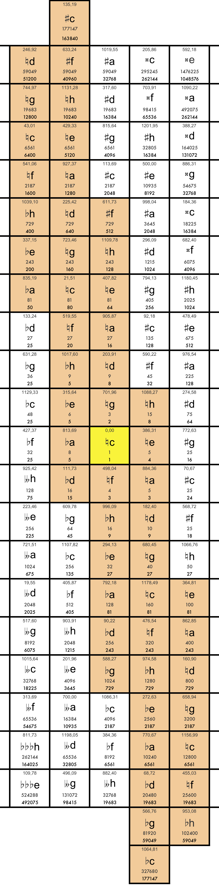

### Fingerprints of meantone and other tunings  (2016)

These fingerprints are models of the tunings, allocateting an array of tones on a two-dimensional (Euler) limit-5 grid, where each of the tones of the tuning is replaced by the closest tone on the limit-5 grid (starting at the centre and adding the other notes without loosing the connections in the array).

The form of the fingerprint indicates the preference of the tuning for specific intervals (e.g. the horizontal shape of the 31-tone tuning allows an extensive use of perfect major thirds, the more and more vertical shapes of 55 and 53 are transferring the preference towards the perfect fifth).

x-axis (horizontal): perfect thirds (ratio $\frac{5}{4}$)

y-axis (vertical): perfect fifths (ratio $\frac{3}{2}$)

First line in the field: cents

Second line in the field: note name

Third line in the field: numerator of the ratio

Fourth line in the field: denominator of the ratio

#### I - The meantone tunings with the 31-, 50- and 55-tone circle

- Fingerprint of the $\frac{1}{4}$-comma tuning (31 tones, Vicentino, Arciorgano, first mode, quasi cyclic with perfect major thirds: ratio $\frac{5}{4}$), original disposition of keys on the Arciorgano

The golden fileds are matching perfectly the ratio.
The fifths are calculated as $\frac{1}{4}$-comma diminished fifths.
Each of the half-coloured fileds with the same note name are perfectly in the same distance ($\frac{1}{2}$-comma) to the allocated ratio.

- Fingerprint of the $\frac{2}{7}$-comma tuning (50 tones, quasi cyclic with perfect chromatic semitones: ratio $\frac{25}{24}$), centered on *c*

The golden fileds are matching perfectly the ratio.
The fifths are calculated as $\frac{2}{7}$-comma diminished fifths.
The two half-coloured fileds (asasasas / eisisis) are perfectly in the same distance ($\frac{3}{7}$-comma) to the allocated ratio.

- Fingerprint of the $\frac{1}{6}$-comma tuning (55 tones, quasi cyclic with perfect diatonic tritone: ratio $\frac{45}{32}$), centered on *c*

The golden fileds are matching perfectly the ratio.
The fifths are calculated as $\frac{1}{6}$-comma diminished fifths.
Each of the half-coloured fileds with the same note name are perfectly in the same distance ($\frac{1}{2}$-comma) to the allocated ratio.

#### II - other tunings (53-tone circle, "Walter-pseudorein")

- Fingerprint of the 53-tone cycle

The distance between the notes of the 53-circles and the allocated notes on the limit-5 grid is max. $\frac{1}{2}$ -Schisma (ca 1 cent).

Wolfe-fifth d (246,92cents) / bh (953,08cents) = 706,16 cents

- Fingerprint of the Arciorgano-tuning "Walter-pseudorein"

Fields with vertical lines: schismatic changed fifths.

The distance between the notes of the tuning and the allocated notes on the limit-5 grid is max. $\frac{1}{2}$ -Schisma (ca. 1 cent).

